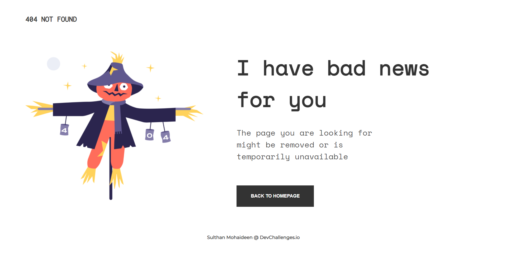

<!-- Please update value in the {}  -->

<h1 align="center">Error 404 Page</h1>

   Solution for a challenge from  <a href="http://devchallenges.io" target="_blank">DevChallenges.io</a>.

  <h3>
    <a href="https://theerrorpage.netlify.app/">
      Demo
    </a>
     | 
    <a href="https://github.com/SulthanNK/Error-404-Page">
      Solution
    </a>
     | 
    <a href="https://devchallenges.io/challenges/wBunSb7FPrIepJZAg0sY">
      Challenge
    </a>
  </h3>

<!-- TABLE OF CONTENTS -->

## Table of Contents

- [Overview](#overview)
  - [Built With](#built-with)
- [Features](#features)
- [Acknowledgements](#acknowledgements)
- [Contact](#contact)

<!-- OVERVIEW -->

## Overview

- Where can I see your demo?

  <h3><a href="https://theerrorpage.netlify.app/"> Click Here </a></h3>

- What have you learned/improved?

  Learned about built web page with responsiveness based on different devices.

### Built With

<!-- This section should list any major frameworks that you built your project using. Here are a few examples.-->

- [HTML5](https://en.wikipedia.org/wiki/HTML5)
- [CSS3](https://en.wikipedia.org/wiki/CSS)

## Features

This site was created as a submission to a [DevChallenges](https://devchallenges.io/challenges) challenge. The [challenge](https://devchallenges.io/challenges/wBunSb7FPrIepJZAg0sY) was to build an application to complete the given user stories.

## Acknowledgements

- [Steps to replicate a design with only HTML and CSS](https://devchallenges-blogs.web.app/how-to-replicate-design/)

## Contact

- GitHub [@SulthanNK](https://github.com/SulthanNK)
- Twitter [@SulthanNK](https://twitter.com/SulthanNK)
